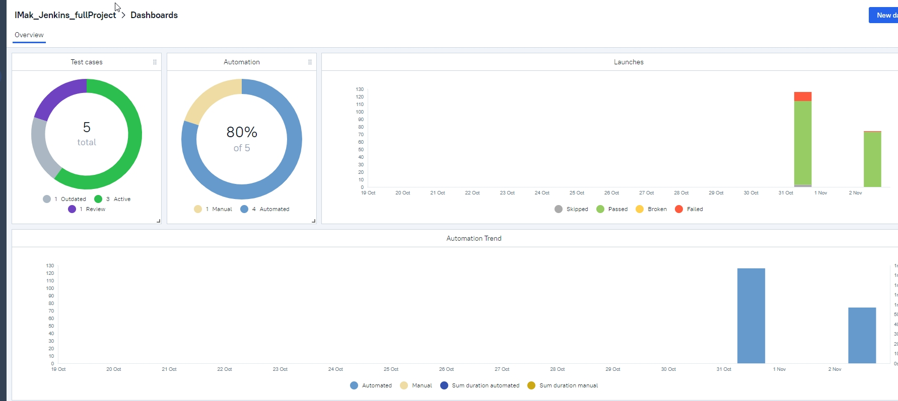
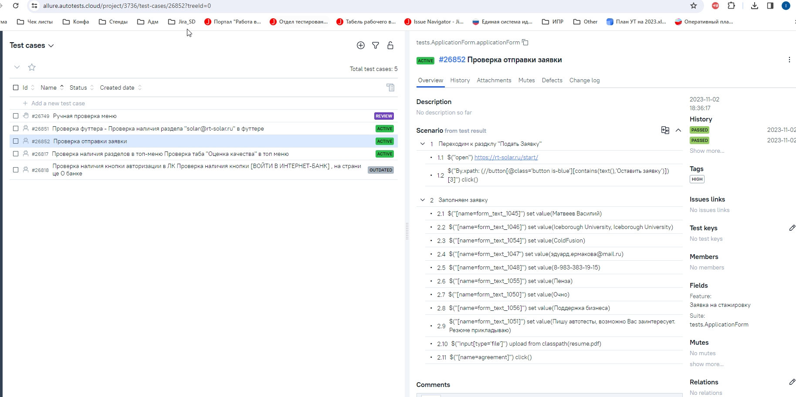
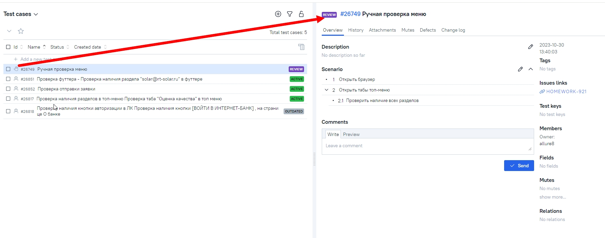
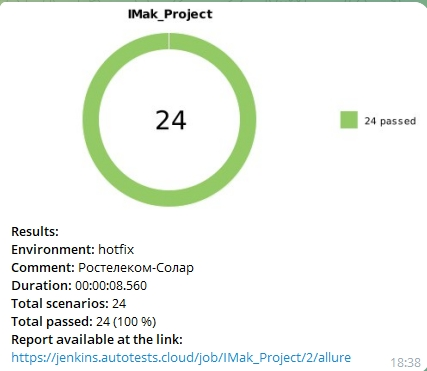
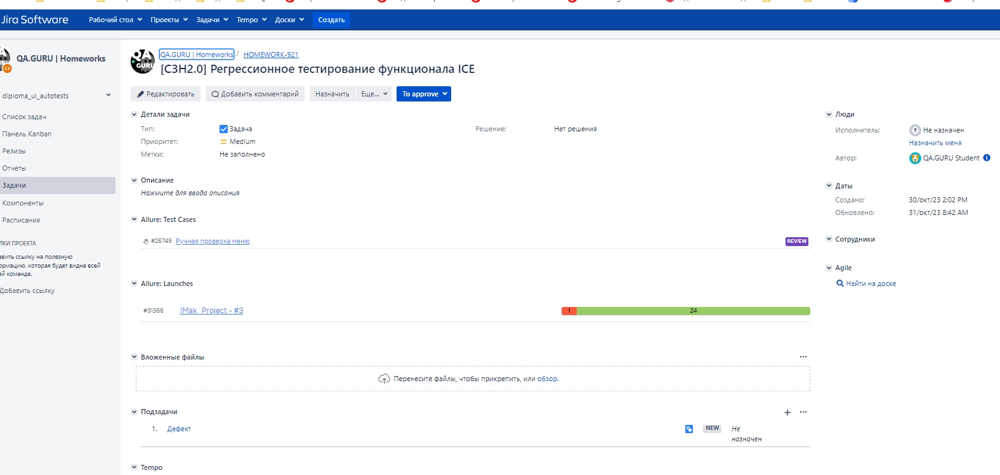

# <a href="https://rt-solar.ru/start/"></a> Проект по автоматизации тестирования для «Ростелеком-Солар»

## :technologist: Технологии и инструменты

<p  align="center">

<a href="https://www.jetbrains.com/idea/"></a>
<a href="https://www.java.com/"></a>
<a href="https://selenoid.autotests.cloud/"></a>
<a href="https://selenide.org/"></a>
<a href="https://gradle.org/"></a>
<a href="https://junit.org/junit5/"></a>
<a href="https://github.com/"></a>
<a href="https://allurereport.org/"></a>
<a href="https://qameta.io/"></a>
<a href="https://www.jenkins.io/"></a>
<a href="https://www.atlassian.com/ru/software/jira"></a>
<a href="https://web.telegram.org/"></a>
</p>


## :heavy_check_mark: Список проверок, реализованных в автотестах

- [x] Проверка кликабельности кнопки "Подать заявку"
- [x] Проверка полей формы для отклика на стажировку
- [x] Проверка управляющих элементов формы
- [x] Проверка заголовков на главной странице
- [x] Проверка наличия логотипа на главной странице
- [x] Для проверки рездела FAQ и футтера страницы применены параметризованные тесты
- [x] Имеются интеграции с Jira и Allure TestOps


## :heavy_check_mark: Список проверок, реализованных в ручных тестах

- [x] Проверка ссылок на главной странице
- [x] Проверка работы кнопки "Обратная связь"

## :rocket: Запуск тестов

###  :rocket: Локальный запуск :
```bash
./gradlew test
```

###  :rocket: Удаленный запуск (в Jenkins):
<p align="center">

</p>

1. Открыть <a target="_blank" href="https://jenkins.autotests.cloud/job/IMak_Project/">проект</a>
2. Нажать **Build with Parameters**
3. Результат запуска сборки можно посмотреть в отчёте Allure

## :triangular_flag_on_post: Allure отчеты:

### Отчет в Allure</a> <a target="_blank" href="https://jenkins.autotests.cloud/job/017-aolshanskaya-hw_14/12/allure/"> report</a>

#### :black_small_square: Основной отчет
<p align="center">

</p>

#### :black_small_square: Тесты
<p align="center">

</p>

### Отчет в Allure</a> <a target="_blank" href="https://allure.autotests.cloud/jobrun/19967"> TestOps</a>

#### :black_small_square: Основной отчет
<p align="center">

</p>

#### :black_small_square: Тесты
<p align="center">

</p>

#### :black_small_square: Пример ручных тестов
<p align="center">
  
</p>

## Telegram уведомления</a>

<p align="center">

</p>

## Atlassian Jira интеграция</a>
<p align="center">
  
</p>

##  Selenoid видеозапись тестов</a>
### Видеозапись прохождения тестов

<p align="center">

  

</p>
